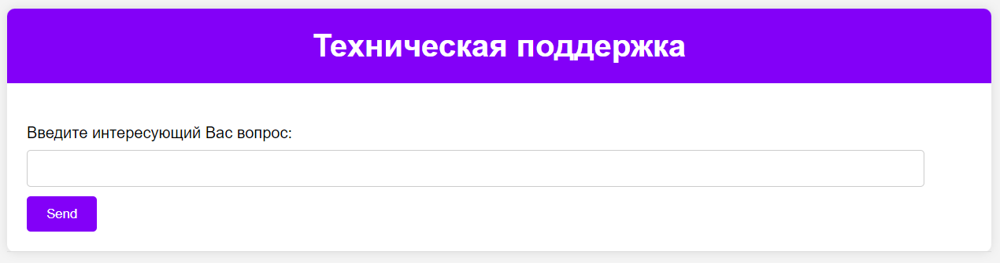

# Инструкция по установке и запуску вопросно-ответной системы (ВОС)
---

#### Аннотация
В современном мире множество организаций, включая маркетплейсы, банки, HR и другие, ежедневно сталкиваются с большим объемом обращений от клиентов различного характера и назначения. Для обработки таких обращений часто применяются автоматизированные системы. В данном исследовании была разработана __вопросно-ответная система__, предназначенная для генерации ответов на обращения в техническую поддержку менеджеров пунктов выдачи заказов. Для реализации проекта были использованы следующие фреймворки и технологии: __AutoGen__, __RAG__ и __WebSockets__. Подход к решению задачи организован на основе __многоагентных систем__. __Структура проекта__ включает в себя директории для входных данных (input_data), виртуального окружения (venv), хранения кэша (.cache) и векторной базы данных (tmp\db), основной файл с исходным кодом (main.py), конфигурационные файлы (OAI_CONFIG_LIST и docs_path_cofig_list.ini), список необходимых библиотек (requirements.txt) и краткую документацию (README.md).

---
#### Инструкция
1. Создать виртуальное окружение:
```
python -m vevn venv
```
2. Активировать виртуальное окружение:
```
.\venv\Scripts\activate
```
3. Установить зависимости:
```
pip install -r .\requirements.txt
```
4. Настроить файл OAI_CONFIG_LIST:
```
[{
    "model": "cohere/command-r",
    "base_url": "https://api.vsegpt.ru/v1/",
    "api_key": "sk-..."
}]
```
Если используете ключ от OpenAI в явном виде, то конфиг файл будет выглядеть следующим образом:
```
[{
    "model": "gpt-3.5-turbo",
    "api_key": "sk-..."
}]
```
5. Настроить файл docs_path_config_list_ini:
Введите вместо "Your_file.name" имя своего файла, который будете использовать, как входной документ.
_Примечание_: на текущий момент файлов обязательно должно быть два!
```
[Changeable_values]
docs_path_qa = ./input_data/Your_file.name
docs_path_kb = ./input_data/Your_file.name
```
6. Запустить ВОС:
```
python main.py
```
---
__Примечания__:
> После запуска ВОС необходимо: 
    1. Перейти по адресу: http://localhost:8000/ (в консоли будет предложена ссылка);
    2. В поле ввода написать интересующий Вас вопрос;
    3. Нажать на "Send" и немного подождать, пока модель сгенериует итоговый ответ.

> Перед тем, как задать следующий вопрос: __обновите страницу__
---
__Список использованных источников__:
[1] https://microsoft.github.io/autogen/blog/2023/10/18/RetrieveChat/
[2] https://github.com/microsoft/autogen/blob/main/notebook/agentchat_groupchat_RAG.ipynb
[3] https://microsoft.github.io/autogen/docs/notebooks/agentchat_websockets/
[4] https://github.com/microsoft/autogen/blob/main/notebook/agentchat_websockets.ipynb
[5] https://www.sbert.net/docs/pretrained_models.html